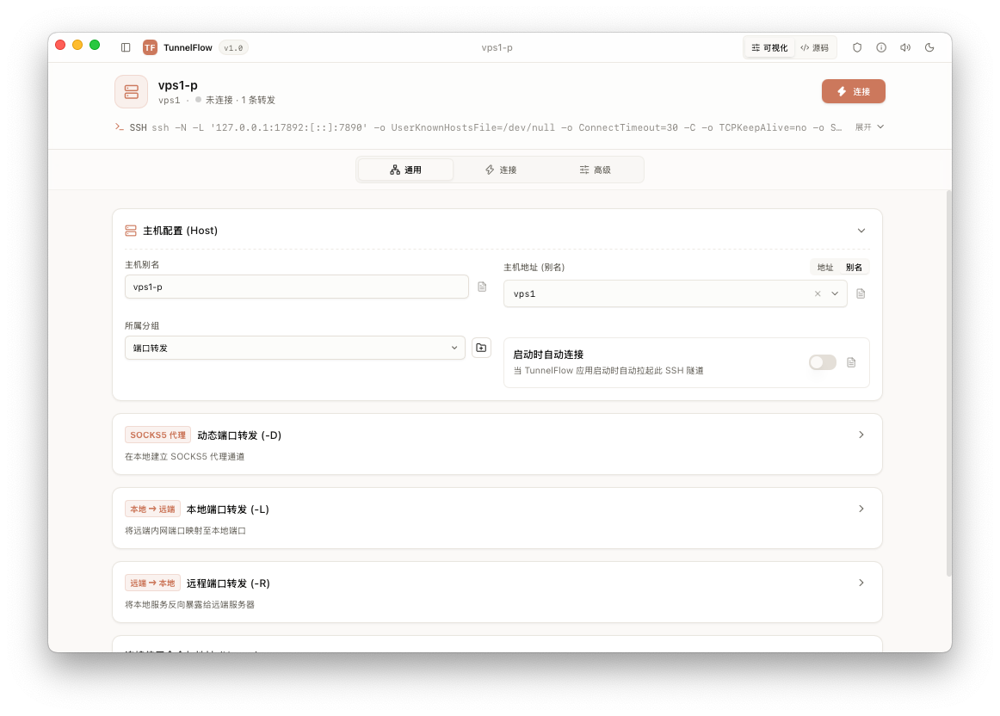
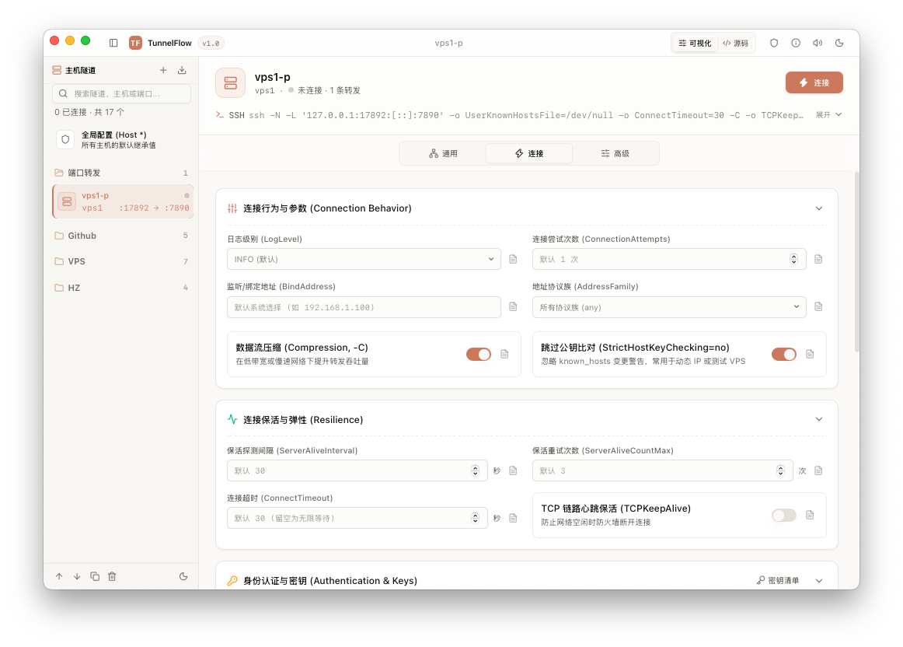
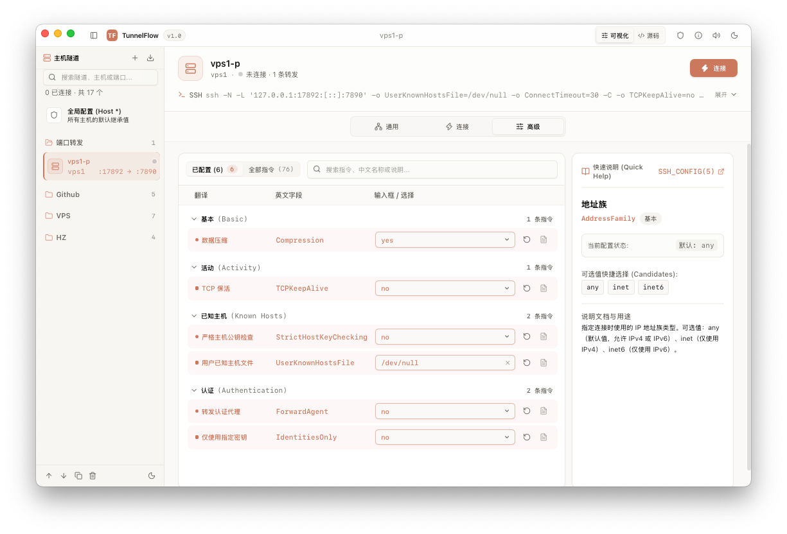
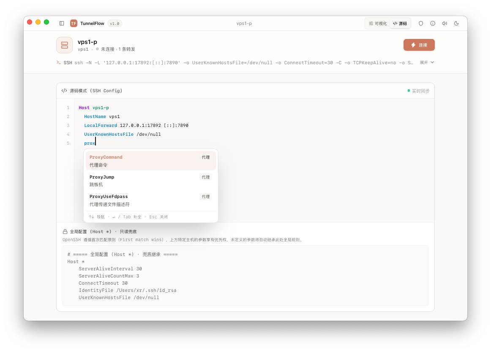
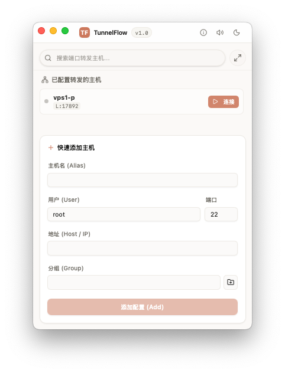

# TunnelFlow ⚡

> **Next-Generation Cross-Platform SSH Tunnel & Port Forwarding Manager**  
> *Designed for macOS, Windows, and Linux.*

[](https://tauri.app/)
[](https://www.rust-lang.org/)
[](https://react.dev/)
[](https://tailwindcss.com/)

---

## 📸 界面预览 (Screenshots)

### 常规配置 (General)


### 连接设置 (Connection)


### 高级设置 (Advanced)


### 源码模式 (Source Mode)


### 迷你模式 (Mini Mode)


---

## 🌟 核心亮点 (Key Features)

- 🚀 **极轻量原生体验**：基于 Tauri v2 + Rust 后端，安装包仅约 **8MB**，空闲内存占用仅 **~35MB**（相比 Electron 节省 80%+ 内存）。
- 🔄 **无损双向同步 `~/.ssh/config`**：Rust 原生无损语法解析器，严格保留注释（`# ...`）、缩进格式与未知自定义指令。提供可视化表单与**双向源码编辑器**（支持 ⌘S / Ctrl+S 实时解析并即时保存）。
- 🛡️ **全模式端口转发**：
  - **动态端口转发 (Dynamic, `-D`)**：一键生成本地 SOCKS5 代理。
  - **本地端口转发 (Local, `-L`)**：将本地流量穿透转发到远端内网服务。
  - **远程端口转发 (Remote, `-R`)**：公网反向代理 / 内网穿透到本地端口。
- 🌓 **双视图界面 (Dual-Mode UI)**：
  - **标准工作台模式 (Full Mode)**：现代化双列响应式布局、多分组管理、密钥库管理、命令行解析导入、高级参数配置。
  - **极简迷你模式 (Mini Mode)**：专为极客设计的 370x660 紧凑悬浮视图，一览所有正在转发的端口与活跃状态，快速一键启停。
- 🔔 **系统托盘与常驻菜单栏 (System Tray)**：
  - 原生托盘常驻，支持关闭/最小化到托盘后台运行；
  - 动态托盘菜单：实时展示全部分组中当前活跃的端口转发（包含本地端口与目标地址）、一键快速连接/断开、快速呼出主窗口。
- 🗂️ **分组管理与拖拽排序**：
  - 支持创建/折叠多个分组；
  - 支持列表内自由平滑拖拽排序及跨分组拖拽转移，状态自动持久化。
- ⚡ **连接弹性与后台守护 (Resilience)**：心跳探测 (`ServerAliveInterval`)、最大重试次数 (`ServerAliveCountMax`)、连接超时 (`ConnectTimeout`) 视觉化配置；后台 SSH 进程生命周期精准守护。
- 🔑 **无缝密钥发现**：原生动态检索 `~/.ssh/` 密钥与证书，无需手动导入。
- 📋 **一键剪贴板导入**：任意复制类似 `ssh -N -L 127.0.0.1:8080:10.0.0.1:80 root@vps` 的命令行，TunnelFlow 会自动解析为结构化配置。
- 💻 **真正跨平台**：
  - **macOS**：原生 Overlay 磨砂标题栏与平滑窗口控制。
  - **Windows**：原生 WebView2 驱动，完美兼容。
  - **Linux**：GTK3 WebKit 渲染。

---

## 🛠️ 技术架构 (Architecture)

```text
TunnelFlow/
├── src/                        # 前端 (React 19 + TypeScript + Tailwind v4)
│   ├── components/
│   │   ├── ui/                 # 现代化 UI 组件库
│   │   ├── tabs/
│   │   │   ├── GeneralTab.tsx  # 主机配置 & 端口转发管理
│   │   │   ├── ConnectionTab.tsx# 弹性保活 / 认证密钥 / 多路复用
│   │   │   └── AdvancedTab.tsx # 自定义指令扩展
│   │   ├── Sidebar.tsx         # 隧道列表 / 分组折叠 / 拖拽排序 / 搜索
│   │   ├── TitleBar.tsx        # 自定义跨平台标题栏 (支持原生窗口拖拽)
│   │   ├── TunnelHeader.tsx    # 连接状态 / 一键开关 / SSH 命令行预览
│   │   ├── SourceEditor.tsx    # ~/.ssh/config 双向实时源码编辑器 (⌘S 实时同步)
│   │   ├── MiniModeView.tsx    # 极简迷你模式视图 (370x660 单列展示)
│   │   ├── KeysModal.tsx       # SSH 密钥库弹窗
│   │   └── ImportCommandModal.tsx # SSH 命令行解析导入器
│   ├── services/
│   │   └── api.ts              # Tauri IPC 调用层
│   ├── types/
│   │   └── tunnel.ts           # 核心领域模型定义
│   └── App.tsx                 # 主页面容器 (双模式入口)
│
└── src-tauri/                  # 后端 (Rust + Tauri v2)
    ├── src/
    │   ├── main.rs             # 入口
    │   ├── lib.rs              # Tauri 插件、状态注册与应用初始化
    │   ├── commands.rs         # Tauri IPC 暴露指令
    │   ├── models.rs           # 跨语言类型定义与序列化
    │   ├── ssh_config.rs       # 无损 ~/.ssh/config 读写解析器
    │   ├── process_manager.rs  # SSH 后台进程生命周期守护
    │   ├── key_manager.rs      # ~/.ssh/ 私钥与证书扫描器
    │   └── tray.rs             # 动态系统托盘菜单管理 (活跃端口渲染)
    ├── Cargo.toml
    └── tauri.conf.json
```

---

## 🚀 快速上手 (Quick Start)

### 1. 安装依赖

```bash
cd TunnelFlow
pnpm install
```

### 2. 本地开发预览 (Web 模式)

```bash
pnpm dev
# 浏览器访问 http://localhost:1420
```

### 3. 本地开发运行 (桌面端模式)

```bash
pnpm tauri dev
```

### 4. 生产构建打包

```bash
pnpm tauri build
```
生成产物位于 `src-tauri/target/release/bundle/`:
- **macOS**: `.dmg` (Universal binary 支持 Intel / Apple Silicon)
- **Windows**: `.msi` / `.exe`
- **Linux**: `.AppImage` / `.deb`
